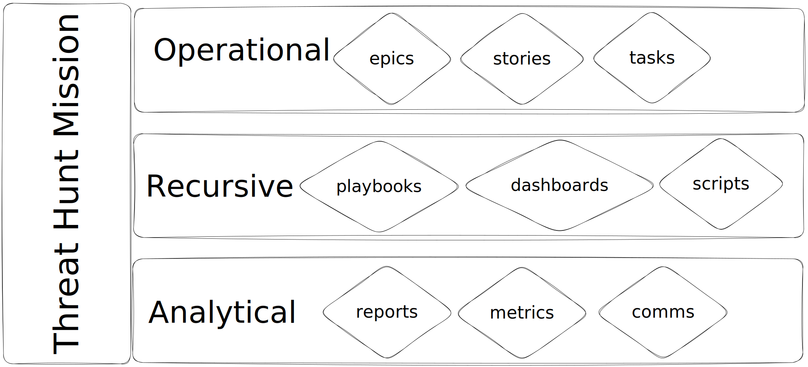
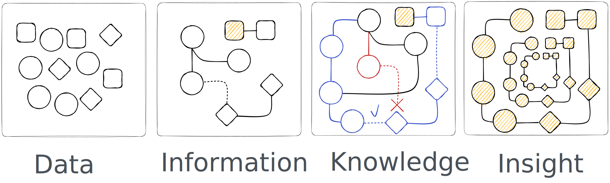
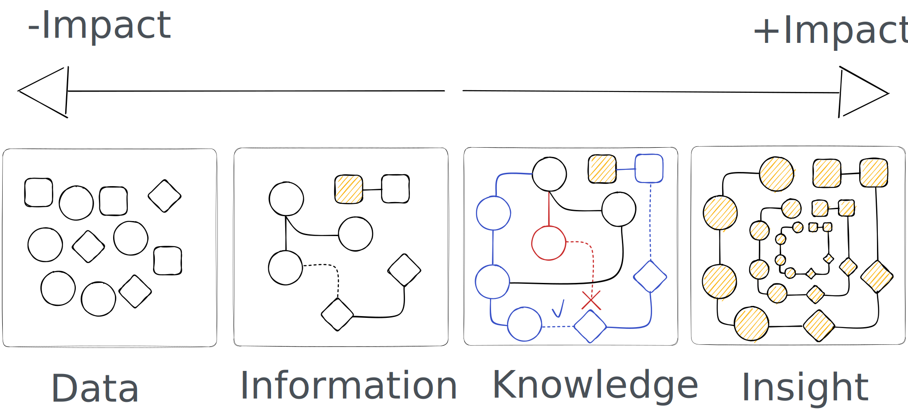
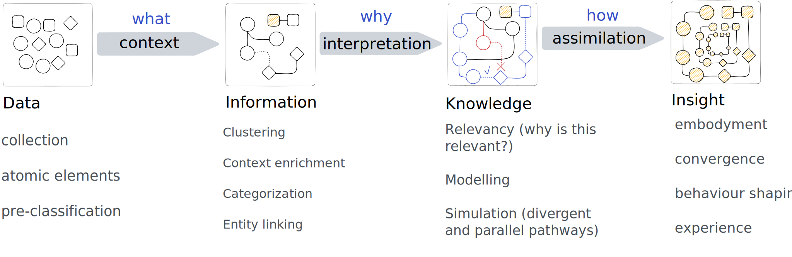
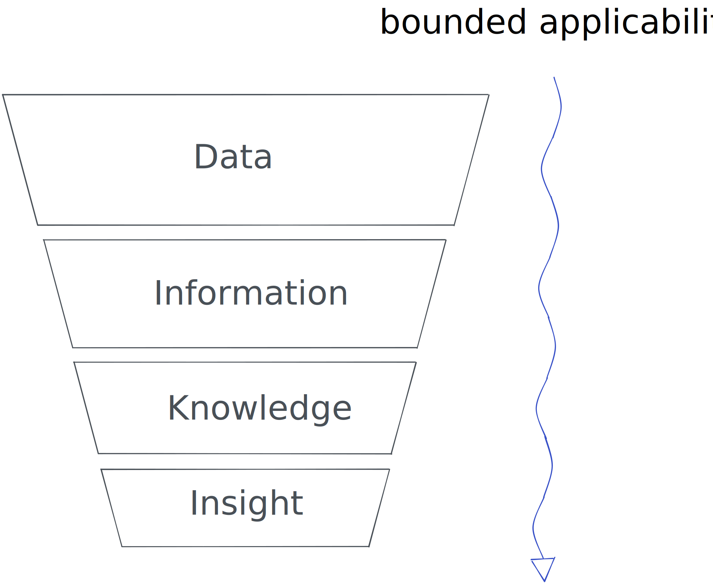
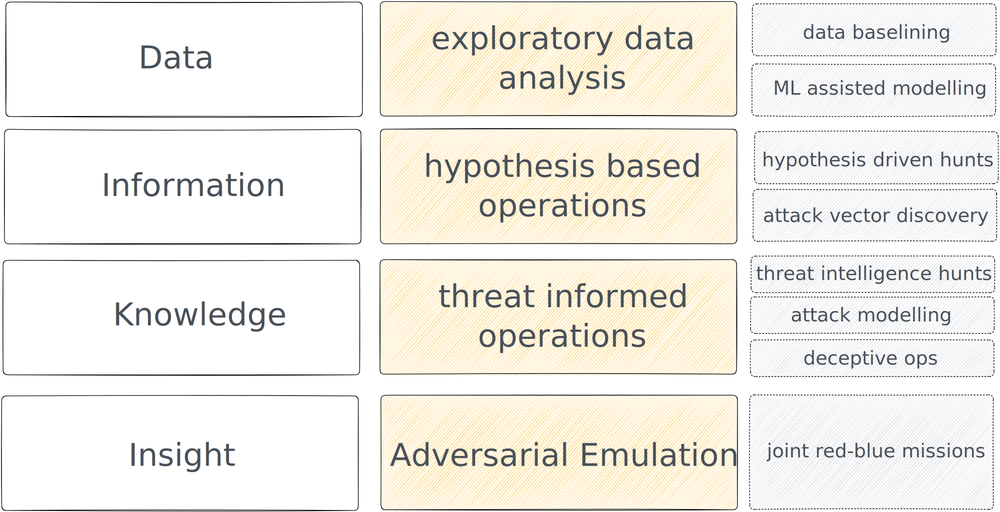

# What is Adversarial Interception Mission Oriented Discovery and Disruption?

Adversarial Interception Mission Oriented Discovery and Disruption Framework, or **AIMOD2**, is a structured threat hunting approach to proactively identify, engage and prevent cyber threats denying or mitigating potential damage to the organization. The core concepts that structure AIMOD2 are:

- **Adversarial**: the framework has cyber conflict at the center of its constitution, as such, it strives to think of and model cyber threats from both the point of view of the attacker and the defender. The ability to model attack paths (as described by frameworks like MITRE Attack Flow) and incorporate adversarial tradecraft into the conceptualization of threat hunt missions helps hunters stay focused on contextually relevant objectives. The adversarial aspect of the framework is enhanced when adding a threat simulation or purple team approach to the missions.
- **Interception**: Interception refers to a type of interference in the trajectory or course of action of an agent or an object. It assumes that there are patterns that threat actors employ, since no one is exempt from them, which end up becoming tendencies that shape a specific course of action. As such, interception aims to stop or interfere with the progress of that chain of events. This can be done in various contexts, such as intercepting an encrypted message being transmitted by a C2, or intercepting a phishing campaign on the build in order to frustrate its success.
- **Mission Oriented**: everything in AIMOD2 is a mission. A Threat Hunt Missions is a semantic and operational unit of work that structures threat hunting efforts around a topic, theme, threat actor, etc.
- **Discovery**: the continuous synthesis of information into different layers of abstraction to help develop contextual awareness and insight. The discovery domain is characterized by the simultaneous scouting of known and unchartered territory. Discovery activities involve data analytics.
- **Disruption**: the goal of disruption is to break the patterns that the adversary has memorized, either through purposeful training or repetition arising from environmental constraints. Disruption is the act of employing manoeuvres to destabilize the opponent to a degree that dismembers their formation leading to imminent defeat. In cyber operations, disruption takes place when the adversary’s capabilities are so impaired that they are forced into a zone of confusion which imposes a high cost of operations whilst attempting to get back into balance. This state of confusion opens a window of opportunity to achieve defensive mission objectives.

AIMOD2 draws from the approaches described in “The Threat Hunting Shift Part 3: [Adversarial Framework for Tactical Cyber Defense Operations](Adversarial%20Framework%20for%20Tactical%20Cyber%20Defense%20Operations.md)“

# Threat Hunting Missions

A Threat Hunt Missions is a semantic and operational unit of work that structures threat hunting efforts around a topic, theme, threat actor, etc.

- Missions represent units of time, which are usually measured in sprints within an Agile framework.
- Hunt Missions are iterative in nature, they can be improved upon and executed as many times as needed.
- Hunt Missions are ideally collective efforts, where at least two hunters are participating in the design, development and execution.
- Hunt Missions have a clearly designated “Mission Lead” whose role is to orient and drive the mission objectives. The Mission Lead is accountable for the mission end to end.
- Hunt Missions are virtual structures, that can incorporate resources from other teams which don’t normally focus exclusively on hunting: SOC analysts, DFIR specialists, purple or red teamers, etc.
- Last but not least, hunt missions make up an iterative approach towards innovation: the research performed during a mission development can quickly become a new service line or product offering.

## The Three Layers of Threat Hunt Missions

Threat hunt missions can be described as three different layers that are interconnected. Each of these layers can be developed in parallel or in sequence but the three of them are necessary for the successful execution of hunting missions. As a threat hunt mission progresses, each layer generates artefacts of particular types which capture the evolution of the hunt's activities.

### Operational Layer

In this layer, we monitor the progress of a hunting mission, the who, what, why and how. A hunt mission is represented here in terms of components that help schedule and monitor the evolution of it. This level helps us organize the hunt mission by breaking it down into phases and tasks within them. The framework employed by AIMOD2 to run the operational level is Agile, in its SCRUM implementation. The types of activities that we track in this level are:

- Layout of the hunt mission as phases and tasks
- Task accountabilities and overall hunt progress
- Response or disruption actions: escalation of suspicious events (potential security incidents), Threat Intelligence Observables (TIO) or security control risks, etc.

**Associated Artifacts**: Epics, Stories or Tasks.

### Recursive Layer

At this layer, we capture the contextual information and data insights from our hunt and encapsulate them in artifacts that are capable of being reproduced and repeated. Threat Hunting is an iterative process, the results of our hunting and research efforts need to be recorded in a reproducible format that enables continuous improvement. The way we improve our hunt missions is by iterating through them in a manual or automated way.

**Associated Artifacts**: threat hunt playbook, iterative analytics (dashboards, stored queries and alerts, automation scripts)

### Analytical Layer

At this level we capture the measurable results of an iteration of a hunt mission. The results of this particular iteration of a hunt are unique to this instance of it and represent a snapshot in time. In this layer, we want to produce an artifact that captures high level metrics and documents observed risks, this is usually delivered as a report. There are other artefacts that are useful to understand the hunting mission's outcomes too: metadata such as sprint velocity and size, comparative impact of hunt outcomes, etc. provide an indication of the quality and value-add of our cyber hunting efforts.

**Associated Artifacts**: reports (a snapshot of a hunt), metrics, comms.

# Hunt Data Semantics

An often overlooked aspect of threat hunting frameworks is the approach to data semiotics and semantics, i.e. **what are the structures that produce sense-making and meaning extraction from data**. Threat Hunting is, in the end, the child of data science and cyber security. 

Data semantics is the ability to interpret data in order to gain a deeper understanding of underlying relationships and patterns that can provide higher levels of insight into the data set. This is a core concept of the AIMOD2 framework since it helps uncover the deeper levels of connectedness behind the data.

There is, however, one more reason for any threat hunt framework to make its data semantics explicit: *to describe the differentiating factors that bring about diverse hunt types*.

## The Semantic Chain: DAIKI

Some threat hunt frameworks break down hunt types by trigger (which team or process triggers a particular hunt), others break it down by data types, e.g. network data vs endpoint data. All these approaches lead to confusing hunt structures and miss the point of what threat hunting is really about: extracting meaning out of data, and devising ways of identifying behavioural patterns. In that regard threat hunting is no different to data science approaches.

For AIMOD2, hunt types are differentiated by the position in which we commence our data analysis in the road from data to insight, i.e. the path that leads from atomic, disconnected data points to highly connected, insight-based impact. We call this model the DAIKI: **Data --> Information --> Knowledge --> Insight**. This model is an adaptation of the known [DIKW pyramid](https://en.wikipedia.org/wiki/DIKW_pyramid) (Data, Information, Knowledge and Wisdom).

### DAIKI and Impact

The aim of any threat hunt mission is to produce impact. AIMOD2 is mission-driven because it is impact-driven. Impact can be defined as the effect an activity, event or decision produces on the organization's resilience. In cyber threat hunting, our goal is to mitigate threats and help reduce the organization's risk exposure, thus increasing organizational resilience. 

But what does impact have to do with data semantics? AIMOD2 considers that impact is generated by a threat hunt team at every level of the semantic chain. However, the further along the semantic chain you produce outcomes, the higher the impact and added value that is delivered to an organization. Concomitantly, the further along the semantic chain you begin your hunt mission from, the easier it is to drive your outcomes to the insight stage.

Limiting a team's focus to only atomic and disconnected data, such as sweeping the environment with hashes, does not yield the same impact as when the team utilize synthesized knowledge derived from threat intelligence.

### The DAIKI Stages

What drives the progression from low connected data to highly connected insight is a series of synthesis operated by one or many teams in an organization. The transitional states that link the different stages imply the extraction of meaning that radically transforms the quality of the information.

Information can be described as contextualized data, knowledge as interpreted information and insight as assimilated knowledge that becomes a new way of doing and thinking. These transitional states are dominated by the **what** (data to information), the **why** (information to knowledge) and the **how** (knowledge to insight).

What drives the transition through each stage is the concept of **bounded applicability**, borrowed from [Cynefin's](https://cynefin.io/wiki/Cynefin_Domains) framework for complexity, which I've mentioned already multiple times [here](https://threathunterz.com/posts/threat-hunting/the-way-of-the-intercepting-fist-part-1/), [here](https://threathunterz.com/posts/breaking-threat-hunting-part-2/) and [here](https://threathunterz.com/posts/threat-hunting/the-way-of-the-intercepting-fist-part-3/). Cognitive Edge's glossary defines *bounded applicability as*:

> the concept that different and contradictory things work in different bounded spaces

In other words, there are no context-free situations. When transitioning from one stage to the next in DAIKI, we make choices that imply we focus on some data clusters over others, and choose models that lead to a specific solution over others. In this process we discard scenarios and limit the amount of data we work with.

# Threat Hunt Mission Categories

## DAIKI applied to Threat Hunt Missions

If we keep in mind that cyber threat hunting is all about data science applied to the discovery and disruption of cyber threats, it makes sense that we can employ DAIKI to bring clarity to data analytic approaches during threat hunting. DAIKI can be used to differentiate between threat hunting mission types depending on the stage of the semantic chain where they operate. As such, there are four main hunt approaches based on the level of informational connectedness we are working with:

### Exploratory Data Analysis (EDA)

These mission types start at the very bottom of our data semantics chain, their purpose is to help us understand the "**what**": what data we are dealing with, is it structured or unstructured, what is the shape of the data, what are the basic components of it, what are the circumstances under which it was collected, what processes were involved in collecting the data, etc. Most hunt missions have some sort of exploratory data analysis phase. In this sense, threat hunting teams operate in a very similar way to data science teams.

*Example: imagine you want to understand whether an organization has logs that provide evidence for data exfiltration using Microsoft O365 Exchange suite*.

You would first need to understand how that organization is logging data overall (is there a SIEM, is there a data lake, are there any log retention policies, is logging enabled at the O365 tenancy level, etc.), then explore where that data could be, how is it being parsed and stored, what level of granularity is provided. Doing your research you may stumble upon the O365 Unified Audit Log. The UAL is a complex set of deeply nested log structures, you will have to figure out what each log type means, and how user activity is logged, what are the most prominent activity types vs the ones observed less often, etc. 

Depending on the complexity of the data at hand, and the techniques employed to analyze it, this endeavour could easily become a whole hunt mission in itself, in preparation for a second iteration of the mission where you will have a higher understanding of the data structures that will help you achieve mission objectives.

Once you've performed a first pass on your data, you will come out of it with more than just data, you will now start to build **knowledge** from that initial work and will be in a better position to transition your hunt mission to a **hypothesis based operation**.

There are many ways to explore your data. Initially, AIMOD2 considers that the two subtypes of EDA are: **baselining** and **machine learning assisted modelling** (e.g. unsupervised clustering algorithms like k-means). We will define these subtypes in later versions of AIMOD2.

> **Define Process**: threat hunting teams should define a process for the statistical, visual, machine learning assisted and generic manual examination of data for EDA hunt missions. This process shouldn't be exhaustive and extremely detailed, but it should at a bare minimum outline the different approaches that are most useful during data baselining and the best ways to achieve that according to the available technologies in the organization.

### Hypothesis based Operations (HBO)

When we possess some level of context around the data we are working with, but we lack enough situational awareness to integrate this data into threat actor profiles and threat likelihood, we need to focus our hunting efforts based on low to medium confidence hypothetical scenarios.

To drive a hypothesis based scenario, we should have already answered the "what" of data. We have now a more holistic understanding of the data at hand. Baseline, statistical, clustering and manual examination techniques have given us a more consistent idea of the data.

At this point, we are better positioned to formulate a hypothesis that we have good chances at answering since we have some basic level understanding of the underlying data structures.

These hunt missions involve formulating and testing hypotheses or theories based on adversarial tradecraft information collected from  various data sources. Central to the success of hypothesis based hunts is the concept *situational awareness*:

- industry knowledge to understand which threats are most likely to target your business
- infrastructure awareness, to understand your own strengths and weaknesses, e.g. are there unpatched servers in some network segments? which systems have control exceptions? what is the status of cloud and container telemetry?
- security control's awareness: what technologies have been deployed in our environment, who owns the different control stacks?
- risk management knowledge: what is the risk framework in the organization? which teams manage it? how is risk reported and how does the risk matrix look like?
- threat intelligence, to understand the threat landscape and which threat actors are relevant to your business depending on geopolitical and tradecraft factors
- technological landscape, to understand which new or emerging technologies can challenge your cyber defense paradigm

The data above feeds these hunt types, and can be collated at different levels by the same or different teams in the organization. This data needs to be synthesized by the threat hunting team following either heuristic or explicit qualifying rules that help highlight the most relevant topics to focus on.

There are many ways to execute hypothesis based operations. Initially, AIMOD2 considers that the two subtypes of HBO are: **hypothesis driven hunts** and **attack vector discovery**. We will define these subtypes in more detail in later versions of AIMOD2. However, at a high level we can say that:

- **Hypothesis Driven Hunts**. They employ heuristics and basic knowledge of the threat landscape to craft credible attack scenarios that are worth hunting for. We are not yet at the stage of knowledge and as such we lack the informational processing power that a threat intelligence team or specialized third party can provide.
- **Attack Vector Discovery**. Closely linked to attack path modelling and controlled attack paths (which I have touched on [here](https://threathunterz.com/posts/threat-hunting/the-way-of-the-intercepting-fist-part-1/) and [here](https://threathunterz.com/posts/threat-hunting/the-way-of-the-intercepting-fist-part-1/#fn:4)), attack vector discovery is a hypothesis driven mission where our goal is to identify early signs of offensive operations that could impact an organization. An example of this is hunting for phishing campaigns before they are launched (via new domain registration analysis, cloned site identification, DOM hash similarities, etc.) or malware strains that have been inadvertently leaked by cyber criminals which can tip us off on new malware designed to target our business. AVD missions capitalize heavily on the concept that cyber criminals also make OpSec mistakes. It is our job to exploit those OpSec mistakes to our advantage.

> **Define Process**: threat hunting teams should define a process for information collection, prioritization and synthesis, so that it can be turned into contextualized knowledge and actionable insight.

> **NOTE**: to be clear, all threat hunt missions are one way or another subtypes of hypothesis based operations. There is a primordial underlying hypothesis to any hunt operation which is *assuming breach*. But beyond this, threat hunting is about finding the unknown, with the presumption that it is *knowable* by leveraging data analysis and other techniques like deception.

### Threat Informed Operations (TIO)

This is the domain where actionable threat intelligence is essential. Threat intel usually represents higher level data that has been processed into knowledge or insight. When in this stage, our threat hunting efforts can take a higher ROI approach since a lot of the relevancy of the information at hand has been already established by threat intel functions (which can be the same or a different team to that where threat hunters sit).

AIMOD2 defines three basic subtypes of TIO:

- **Threat Intelligence Hunts**. Also known as "Tactical Intel Hunts", these are agile missions carried out by the threat hunting team to break down threat reports (whether from CTI team or other sources like red team engagements) and drive an active assessment of threat indicators in our digital landscape. This is achieved by obtaining relevant threat indicators (both behavioural and atomic), performing searches in our digital infrastructure for any matches and finally enriching our Threat Intel Platform with any expanded knowledge obtained through this assessment.
- **Attack Modelling**. A subset of threat modelling, what we are interested in here is understanding the attack chains and relationships between TTPs. Attack modelling can only happen in the semantic level of knowledge, since we require distilled threat intel and practical knowledge of plausible attack paths (for example, via red team engagements or pentest reports)
- **Deceptive Ops**. Threat Hunting is the driver for cyber deception. As part of a thoughtful cyber deception strategy, these missions will help plan the engagement aspects of the strategy, following industry best practices like [MITRE ENGAGE](https://engage.mitre.org/). These missions will also aim at deploying decoys and lures, as well as crafting specialized decoy systems based off available threat intelligence and attack path models.

### Disruptive Purple Operations (DPO)

It is extremely difficult to truthfully commence a threat hunt effort at the epistemological level of insight. Insight implies embodied knowledge that has been put to practice and internalized into behaviours (these behaviours in turn inform our security controls and risk profile).

However, joint purple operations achieve this goal by combining the insight from red teams, who can craft real attack paths into the organization's crown jewels, with the defensive knowledge from blue teams.

## Threat Hunt Mission Types

We will define all hunt mission subtypes mentioned above under "DAIKI Applied to Threat Hunt Missions" in future versions of AIMOD2, for the moment, we provide the definition for External Attack Vector Discovery, which is one way to interpret Attack Vector Discovery hunts, a subtype of Threat Informed Operations (TIO).

### External Attack Vector Discovery

Standard threat hunting activities focus usually on internal attack vectors, coming from a stance of "assumed breach", and look for threat indicators (atomic, behavioural o anomaly based) within the organization's systems. Contrary to this, External Attack Vector Discovery are threat hunt missions that attempt to discover external threats before they produce significant impact in our organization. Instead of assuming breach, we start by assuming intention on behalf of the threat actors, which means we assume threat actors will first mount operational infrastructure to carry on their targeted campaigns, as well as actively performing reconnaissance on our perimeter. This service has three goals:

The standard approach to threat hunting typically focuses on internal attack vectors, adopting an "assumed breach" stance to identify threat indicators (atomic, behavioral, or anomaly-based) within an organization's systems. Contrary to this, External Attack Vector Discovery represents a proactive approach that aims to uncover external threats before they cause perceivable harm to an organization. Rather than *assuming breach*, this approach **assumes intention** on behalf of threat actors and centers efforts around two important aspects of adversarial operations: 

1. cyber criminals do make OpSec mistakes, their operators are not always equally skilled and the operational procedures they follow might also contain issues, we aim to exploit these OpSec mistakes.
2. we assume threat actors will first mount operational infrastructure to carry on their targeted campaigns, as well as to actively perform reconnaissance on our perimeter.

It's in the early stages of adversarial operation development that we aim to **intercept and disrupt** their efforts.

The primary objectives of these hunt missions are:

- seek to proactively identify threats outside our perimeter network, that are highly likely targeting the organization's clients and employees
- attempt to intercept phishing campaigns and malware strains that are building momentum, with the aim of targeting the organization's clients and employees
- exploit threat actor operational security (OpSec) mistakes that expose adversarial intention and infrastructure

To accomplish these goals, we will leverage tools and services that provide insight into what is happening outside of the trusted digital surface, as well as traditional SIEM and EDR telemetry.

# Threat Hunt Mission Structure

## CAPEO: Collect - Analyize - Plan - Execute - Outcomes

AIMOD2 defines a set of phases for all its mission operations called CAPEO: Collection, Analysis, Planning, Execution and Outcomes.

### Collect

Ensure that threat Intel is collected into a TIP and that proper communication channels exist to make it available and highlight important or relevant cyber threats to stakeholders. 

### Analyze

The analysis phase involves a series of tasks required to perform a pre-assessment and high level examination of the hunt mission. It is not meant to perform a complete investigation on the topic. 

**Initial Research**

Conduct initial Research In the future Cyber Threat Hunt will formulate a systematic approach to conduct initial research on a particular topic, however for the time being the process will be based on security analysis experience, OSINT, and acquired research techniques.

At a bare minimum, the research process should capture what the current literature says about a particular tactic, technique or procedure. This involves reference material like online articles, existing documentation, code repositories, etc. 

**Perform Feasibility Assessment**

Evaluating the practicality and viability of a proposed threat hunt topic.  This involves considering different factors like data availability, quality of available information, skillsets, resource constraints and timelines, etc. In the initial stages of threat hunt maturity, the process will be more based in heuristics and relevancy of threats to an organization as determined by impacted Crown Jewels, major vulnerabilities or emergent threats. There is no systematic approach in the early stages of threat hunt maturity.

> **Define Process**. Threat Hunting Teams should develop threat hunt prioritization model that formulates a systematic approach for feasibility assessment to determine whether a topic qualifies for a hunt mission

**Business and Technical Owner identification**

During the analysis phase, it is important to identify documentation related to the asset, service, or application's business and technical points of contact. This information could prove useful if there are questions regarding those areas which are pertinent to the hunt scoping and qualification process.

**Identify requirements to engage other teams**

During certain threat hunt missions, it may be necessary to collaborate with other teams, both within and outside the cyber security vertical, to achieve the desired goals. To ensure successful collaboration, it is important to identify and assess these requirements early in the threat hunt phase, determining the level of involvement needed from other teams and the deliverables expected. If engaging other teams is necessary to achieve mission objectives, the analysis phase should carefully evaluate and document these requirements.

### Plan

**Designate Mission Lead**

The threat hunt team will designate a Mission Lead which will be in charge of the end to end delivery of the hunt mission. 

**Evaluate and define Scope**

Based on the results of the Analysis phase, a scope for the hunt operation must be determined:

- *Determine Tactical Objectives*. Objectives represent the targets of our mission that must be accomplished to achieve our goals. These tactical objectives will serve as high-level topics whose understanding the hunt party will develop through further research, investigation, or scouting.
- *Allocate expected time for hunt duration end-to-end*. This serves as a basis to understand sprint requirements for the completion of the hunt. Additionally, it will be captured later as two different metrics *"Total Hunt Duration"*, which represents the total duration from initial research to releasing reports, and, *"Execution Phase Duration"* (usually no more than 75% of Total Hunt Duration, so that a quarter of the total hunt duration can be allocated to report writing).

**Determine Hunting Squad Composition**

- It is the task of the Mission Lead to bring in the required resources to accomplish mission objectives, in this case, to designate one or more threat hunters that will become part of the hunting squad.
- Members should be contacted and express their willingness to participate.
- Once the above is completed, a Threat Hunting Squad would have formed.

**Setup Squad Communication Channels**

- The Mission Lead should stand up the appropriate comms channels according to organizational best practice. These channels should serve the purpose of quick day-to-day information sharing and should be recognized as central channels for mission coordination.
- The hunt operation can be given a code name to make things a bit more fun or interesting, but it still needs to fit within a nomenclature rule. Example: *"EAVD01 - Barracuda Muffin" or "EAVD01 - Phishing Campaign Interception"* (where EAVD stands for External Attack Vector Discovery).
- Comms regarding specifics of the hunt operation should happen within this chat channel. Other members can be invited on a need to know basis. 

**Formalize Action Plan in Agile/Scrum**

- Layout the action plan based on the tactical objectives
- Structure the plan according to your Agile or sprint management software

### Execute

**Discovery**

Exploration is an essential activity of Cyber Defence that is linked to the Discovery Tactical Domain. During our exploratory phase we aim to perform the following activities: 

- *data source discovery*: developing an understanding of the data sources relevant to the hunt operation that can yield the best results, where is the data, what are the data types and models, etc. Knowledge about this can be further developed throughout the duration of the whole hunt. 
- *identify relevant stakeholders*: people that can provide important information or support regarding our hunt topic: business owners, technical support teams, etc.
- *find available infrastructure knowledge*: architecture maps, knowledge base articles, policies, procedures, etc. that help provide insight into the people, process and technology that are relevant to our hunt efforts.
- *investigate previous security data*: any relevant incident tickets, Pentests/Red Team reports, Risks or related information that may provide insight into previous security incidents, vulnerabilities or overall risks.
- *interrogate data*: run systematic queries that help you advance in the achievement of mission objectives.
- *data collection*. Data Collection is another essential activity of the [Discovery Tactical Domain](https://threathunterz.com/posts/threat-hunting/the-way-of-the-intercepting-fist-part-3/#discover). Data collection is an ongoing activity that informs all our hunt efforts. Some activities to consider are:
	- document temporary findings on the go in your CRM or ticketing system
	- gather available evidence from insightful data queries and be sure to flag them for Playbook development and Battlefield Intel.

**Disruption**

Disruption activities are an essential part of the [Disruption Tactical Domain](https://threathunterz.com/posts/threat-hunting/the-way-of-the-intercepting-fist-part-3/#disruption). The term *"disruption"* refers to intentionally intercepting cyber adversaries, with two primary tactical purposes: *interception and coercion*.

- intercept anomalous behaviour by applying data analytic techniques to distinguish signal from noise
- escalate suspicious activity (SEOI) so that it can be quickly actioned by downstream teams as per our Incident Response Plan, follow escalation process.
- raise urgent visibility gaps: if there is a log outage affecting our ability to hunt or detect adversarial operations, these need to be raised as per visibility gap process.
- isolate endpoints or accounts: in case active threat activity is observed unfolding and assets are identified, liaise immediately with your DFIR team to evaluate threat containment techniques
 
### Outcomes

Once a threat hunt is completed, there are some outcomes that are produced by the hunt. During the post-hunt phase, these outcomes are captured in *three different artifacts*:

1. **Threat Hunt Playbook**: a combination of a research document and a code recipe. The Playbook is a data analytics story. The best model for this are Jupyter Notebooks applied to data science research. The Threat Hunt Playbook is an iterative artefact that is improved with each iteration of the same hunt mission. The playbook does not care about metrics.
2. **Threat Hunt Report**: the report is a snapshot in time of the results in an iteration of a hunt mission. The report is the container for metrics, here is where we should capture the different operational metrics for the mission.
3. **Comms**: once the report and the playbook have been created, the threat hunt mission needs to be communicated as a story to the target audience. Comms are normally distributed as an email or newsletter. They should at a bare minimum convey the background of the hunt mission, i.e., what motivated it, and a summary of the findings. The more we tell a story with our findings, the more memorable they become, even when there are no security incidents uncovered as a result of the hunt.

In the **Mission Findings & Outcomes** section we cover what are the actual findings that should be captured and communicated as a result of a threat hunt mission.

> **AUDIENCE**: it is important to identify the stakeholders that should become your target audience. They will be the main recipients of your hunt discoveries. Aim to identify stakeholders that can convert your findings into actionable information, so that your findings will help improve the overall security posture of your organization.

## Mission Findings & Outcomes

Here is the single most important thing people get wrong about threat hunting: thinking it is merely about "finding signs of compromise". If you haven't found suspicious activity, then the threat hunting effort has failed. But hunting is much more than that, threat hunting is about creating positive risk impact through discovery activities applied to attack vector disruption. It is about improving your organization's risk exposure by reducing its attack surface. The truth is, depending on the maturity of the target environment, 80% to 90% of the time you won't find "evil". But this doesn't mean you don't find "risk vectors". What security control issues you uncovered? Which visibility gaps you identified? What detection opportunities have you come across? What threat intel observables have you found? How did you expand the knowledge graph around an area or topic of relevance to your organisation? What new analytics have you created for the SOC or IR teams? 

AIMOD2 defines 6 initial findings categories that cyber threat hunting teams can uncover during threat hunt missions. It is extremely rare that a threat hunt team would not be able to populate at least one of these finding categories.

- **visibility gaps**: are there data collection or parsing gaps that are preventing your organization from identifying potential threats?
- **security control issues**: have you found deficiencies in any of the security control layers that are meant to prevent cyber threats?
- **detection opportunities**: have you uncovered new ways of detecting cyber threats that should be turned into detectors, signatures or that might be useful for feature engineering in anomaly ML models?
- **hunt opportunities**: during the course of your hunt mission, have you discovered relevant hunt topics that have not been identified thus far?
- **suspicious security events**: this is the classic finding most threat hunt teams aim to identify, data patterns that point to suspicious activity which should be reported to SOC and IR teams for further investigation.
- **threat intelligence events of interest**: your hunt efforts may lead to expanding the knowledge graph around a tactic, technique or procedure, these new nodes could be observables or interesting information that can be passed on to threat intelligence teams or automation pipelines

# Battlefield Intel

AIMOD2 considers that gathering relevant information during the execution of a hunt mission is paramount to the success of future missions. 

In next iterations of AIMOD2, we will define Battlefield Intel concepts in more depth.
